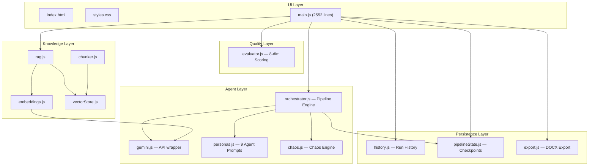

# Code Audit Export — Script Writer v4.0.0

Complete source code audit of the **ScriptWriter** codebase — a multi-agent AI pipeline for generating blue-chip wildlife documentary scriptments.

---

## Codebase Inventory

| File | Path | Lines | Purpose |
|------|------|------:|---------|
| `main.js` | [src/main.js](file:///Users/mmooslechner/Downloads/Projects/Democracy/Script%20Writer/src/main.js) | 2,552 | UI controller, event handlers, pipeline orchestration UI |
| `orchestrator.js` | [src/agents/orchestrator.js](file:///Users/mmooslechner/Downloads/Projects/Democracy/Script%20Writer/src/agents/orchestrator.js) | 1,488 | Core 6-phase pipeline, checkpointing, chaos engine integration |
| `personas.js` | [src/agents/personas.js](file:///Users/mmooslechner/Downloads/Projects/Democracy/Script%20Writer/src/agents/personas.js) | 993 | System prompts for 9 AI agents |
| `chaos.js` | [src/agents/chaos.js](file:///Users/mmooslechner/Downloads/Projects/Democracy/Script%20Writer/src/agents/chaos.js) | 260 | Chaos Engine — mutations, provocations, creative accidents |
| `gemini.js` | [src/agents/gemini.js](file:///Users/mmooslechner/Downloads/Projects/Democracy/Script%20Writer/src/agents/gemini.js) | 125 | Gemini API wrapper — `callAgent`, `createChat`, PDF/URL extraction |
| `evaluator.js` | [src/quality/evaluator.js](file:///Users/mmooslechner/Downloads/Projects/Democracy/Script%20Writer/src/quality/evaluator.js) | 713 | 8-dimension quality scoring, dryrun benchmarking |
| `history.js` | [src/history.js](file:///Users/mmooslechner/Downloads/Projects/Democracy/Script%20Writer/src/history.js) | 252 | IndexedDB run persistence, legacy migration |
| `pipelineState.js` | [src/pipelineState.js](file:///Users/mmooslechner/Downloads/Projects/Democracy/Script%20Writer/src/pipelineState.js) | 126 | IndexedDB checkpoint save/load/clear |
| `export.js` | [src/export.js](file:///Users/mmooslechner/Downloads/Projects/Democracy/Script%20Writer/src/export.js) | 254 | Markdown → DOCX conversion |
| `rag.js` | [src/knowledge/rag.js](file:///Users/mmooslechner/Downloads/Projects/Democracy/Script%20Writer/src/knowledge/rag.js) | 36 | RAG retrieval (query → embed → search → format) |
| `embeddings.js` | [src/knowledge/embeddings.js](file:///Users/mmooslechner/Downloads/Projects/Democracy/Script%20Writer/src/knowledge/embeddings.js) | 45 | `gemini-embedding-001` text embedding |
| `chunker.js` | [src/knowledge/chunker.js](file:///Users/mmooslechner/Downloads/Projects/Democracy/Script%20Writer/src/knowledge/chunker.js) | 46 | Text → overlapping semantic chunks |
| `vectorStore.js` | [src/knowledge/vectorStore.js](file:///Users/mmooslechner/Downloads/Projects/Democracy/Script%20Writer/src/knowledge/vectorStore.js) | 157 | IndexedDB vector store with cosine similarity search |
| `index.html` | [index.html](file:///Users/mmooslechner/Downloads/Projects/Democracy/Script%20Writer/index.html) | 389 | Single-page HTML shell |
| `styles.css` | [src/styles.css](file:///Users/mmooslechner/Downloads/Projects/Democracy/Script%20Writer/src/styles.css) | 3,862 | Premium cinematic dark UI |
| `package.json` | [package.json](file:///Users/mmooslechner/Downloads/Projects/Democracy/Script%20Writer/package.json) | 21 | Dependencies & scripts |
| `vite.config.js` | [vite.config.js](file:///Users/mmooslechner/Downloads/Projects/Democracy/Script%20Writer/vite.config.js) | 9 | Vite dev server config |

**Total: ~10,928 lines across 17 files**

---

## Architecture Overview



---

## Pipeline Phases (orchestrator.js)

The pipeline runs 6 sequential phases, each orchestrated by specific agents:

| Phase | Name | Agents | Purpose |
|------:|------|--------|---------|
| 1 | **Discovery** | Discovery Scout + Market Analyst | Find science, assess market |
| 2 | **Development** | Chief Scientist → Field Producer → Story Producer | Validate science, plan production, draft story |
| 3 | **Murder Board** | Commissioning Editor (+ Provocateur) | Adversarial critique |
| 4 | **Revision** | Showrunner → Story Producer (iterative) | Revise based on feedback |
| 5 | **Final Output** | Story Producer | Polish final scriptment |
| 6 | **Gatekeeper** | Adversary (+ Defamation Guard) | Final audit, score, verdict |

### Key Features
- **Checkpointing** via IndexedDB — pipeline can resume after interruption
- **Chaos Engine** — 3 modes (Precision / Exploration / Chaos) inject mutations, provocations, and creative accidents
- **Context Compressor** — summarizes accumulated pipeline context before later phases
- **Iterative Revision** — configurable 0-5 revision rounds with quality gate feedback loops
- **Seed-to-Dropdown Sync** — parses seed text for platform, year, genre directives and auto-updates UI

---

## Agent Roster (personas.js)

| Agent | ID | Icon | Role |
|-------|----|------|------|
| Discovery Scout | `discovery-scout` | 🔬 | Finds recent scientific discoveries relevant to seed |
| Market Analyst | `market-analyst` | 📊 | Assesses commercial viability, platform fit, scheduling |
| Chief Scientist | `chief-scientist` | 🔬 | Scientific validity gate |
| Field Producer | `field-producer` | 🎥 | Production feasibility, logistics, budget |
| Story Producer | `story-producer` | ✍️ | Core narrative architect ("Chameleon Protocol") |
| Provocateur | `provocateur` | 🔥 | Chaos agent — injects creative disruptions |
| Commissioning Editor | `commissioning-editor` | ⚔️ | Adversarial critique ("Murder Board") |
| Showrunner | `showrunner` | 🎬 | Mediates revision priorities |
| Adversary (Gatekeeper) | `adversary` | 🛡️ | Final audit — GREENLIT / REJECTED / BURN IT DOWN |

### Guardrails
- **Zero Hallucination Policy** — all agents mandated to refuse fabrication
- **Seed Fidelity** — agents cannot change user-specified animals/locations ("Zero Species Drift")
- **Genre Lock** — maintains chosen genre lens throughout pipeline
- **Temporal Anchoring** — agents calibrate against delivery year context
- **Documentary Blacklist** — quality evaluator rejects ethically problematic topics
- **Defamation Guard** — scans final output for legal risk

---

## Tech Stack

| Component | Technology |
|-----------|-----------|
| **Framework** | Vanilla JS + Vite 6.1 |
| **AI Model** | Gemini 2.0 Flash (`gemini-2.0-flash`) |
| **Embeddings** | `gemini-embedding-001` |
| **Search Grounding** | Google Search API (refinement chat) |
| **Styling** | Custom CSS (3,862 lines, cinematic dark theme) |
| **Typography** | Inter + Playfair Display (Google Fonts) |
| **Export** | `docx` 9.5.2 + `file-saver` 2.0.5 |
| **Markdown** | `marked` 17.0.2 |
| **Persistence** | IndexedDB (history, checkpoints, vector store) |
| **Deployment** | Vercel |

---

## Key Subsystems

### Chaos Engine (`chaos.js`)
Three creative modes that inject controlled randomness:
- **Precision** — Standard structured pipeline, no surprises
- **Exploration** — 1 agent mutation + Provocateur + 1 creative accident
- **Chaos** — 2 agent mutations + Provocateur + multiple creative accidents + maximum productive friction

### Knowledge Base (RAG)
Full RAG pipeline for user-uploaded documents:
1. **Upload** → file/URL/PDF ingestion
2. **Chunk** → overlapping semantic chunks (`chunker.js`)
3. **Embed** → `gemini-embedding-001` vectors (`embeddings.js`)
4. **Store** → IndexedDB vector store with cosine similarity (`vectorStore.js`)
5. **Retrieve** → query embedding → top-K search → context injection (`rag.js`)

### Quality Evaluator (`evaluator.js`)
8-dimension scoring with calibration references to award-winning productions:
1. Narrative Structure
2. Scientific Rigor
3. Market Viability
4. Production Feasibility
5. Emotional Resonance
6. Innovation
7. Ethical Standards
8. Platform Fit

Includes **Dryrun Benchmark** — runs 5 test seeds + 1 calibration seed through the full pipeline.

### Refinement Chat (`main.js`)
Post-generation multi-turn chat with Google Search grounding. Supports commands:
- `/undo` — revert last change
- `/rerun` — re-execute pipeline with modifications
- `/help` — show available commands

---

## UI Architecture (`index.html` + `main.js`)

- **Hero Section** — seed input, advanced options, agent roster chips (clickable → prompt editor)
- **Advanced Options** — platform, delivery year, genre lens (12 predefined + custom), chaos mode toggle
- **Pipeline Simulation** — phase indicator (1-6), collapsible agent cards with streaming output
- **Genre Strategy Card** — displays 3 recommended genre lenses during hands-free mode
- **Pitch Deck Viewer** — rendered markdown, Gatekeeper badges (score + verdict + platform), copy/export actions
- **Refinement Chat** — multi-turn QA with slash commands
- **Quality Scorecard** — inline 8-dimension radar after generation
- **Side Panels** — Knowledge Base (upload zone + doc list), Run History (click to reload)
- **Prompt Editor Modal** — click any agent chip to edit its system prompt live
- **Resume Banner** — checkpoint detection on page load for interrupted pipelines
- **Audio Feedback** — Web Audio API chimes for success/error/cancel

---

## Data Flow

```
User Seed → Seed-to-Dropdown Sync → Pipeline Launch
    │
    ├─→ Phase 1: Discovery Scout → Market Analyst
    ├─→ Phase 2: Chief Scientist → Field Producer → Story Producer
    ├─→ Phase 3: Commissioning Editor (+ Chaos Engine)
    ├─→ Phase 4: Showrunner → Story Producer (× N iterations)
    ├─→ Phase 5: Final Story Producer pass
    └─→ Phase 6: Adversary Gatekeeper (+ Defamation Guard)
           │
           ├─→ GREENLIT → Save to History → Auto-Score → Display
           └─→ REJECTED → Revision loop (up to max iterations)
```

---

## Files Read & Verified

All 17 files in the codebase were read in full during this audit. No files were skipped or partially read.
